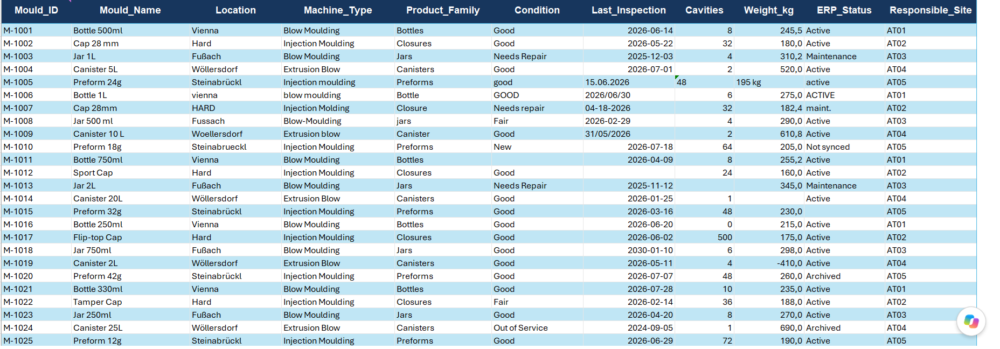

# Power BI Data Cleaning & Quality Checks

A structured data-cleaning and data-quality project developed using **Power BI, Power Query, and Microsoft Excel**.

The project demonstrates how raw manufacturing data can be cleaned, standardized, validated, and documented before being uploaded into an ERP system.

---

## 📌 Project Overview

The raw dataset contains product and mould information with several common data-quality issues, including:

* Duplicate records
* Inconsistent text formats
* Unnecessary spaces
* Missing values
* Invalid inspection dates
* Unusual numerical values
* Inconsistent ERP status values

The objective of this project was to identify these issues, apply appropriate cleaning and validation rules, and clearly document records that require further verification.

---

## 🛠️ Tools Used

* **Power BI Desktop**
* **Power Query**
* **Microsoft Excel**
* Data Profiling
* Data Validation Rules

---

## 🔍 Data Quality Checks

The project includes the following quality-control checks:

* ✅ Identification of duplicate records
* ✅ Standardization of names and text formats
* ✅ Removal of unnecessary spaces
* ✅ Detection of missing values
* ✅ Inspection date validation
* ✅ Mould cavity validation
* ✅ Weight value validation
* ✅ ERP status standardization
* ✅ Individual quality-check columns
* ✅ Consolidated `Data_Quality_Note` column
* ✅ Identification of records requiring verification before ERP upload

---

## 🔄 Data Cleaning Workflow

```text
Raw Excel Data
      ↓
Data Profiling
      ↓
Identify Data Quality Issues
      ↓
Power Query Transformations
      ↓
Validation & Quality Checks
      ↓
Data_Quality_Note
      ↓
Clean & Verified Dataset
      ↓
ERP Upload Readiness
```

---

## 📊 Project Screenshots

### Project Brief


### Raw Data Preview


### Data Quality Checks


---

## 📁 Project Files

| File                                      | Description                            |
| ----------------------------------------- | -------------------------------------- |
| `Mould_Data_Cleaning_Quality_Checks.pbix` | Power BI and Power Query project       |
| `Mould_Data_Raw.xlsx`                     | Original raw dataset and project brief |
| `screenshots/`                            | Project screenshots and previews       |

---

## 🧪 Example Quality Checks

The dataset was evaluated using individual validation columns to make potential issues easier to identify.

Examples include:

```text
Duplicate_Check
Name_Check
Missing_Value_Check
Inspection_Date_Check
Cavity_Check
Weight_Check
ERP_Status_Check
```

These checks were then consolidated into:

```text
Data_Quality_Note
```

This column provides a clear summary of issues that may require manual verification before the data is uploaded into an ERP system.

---

## 🎯 Project Objective

The main goal of this project is to demonstrate a **repeatable data-cleaning and validation workflow** that can be applied to operational or manufacturing datasets.

The approach focuses not only on cleaning the data, but also on **making data-quality issues visible, traceable, and actionable**.

---

## 📝 Notes

This project uses **practice data** and was created for demonstration and portfolio purposes.

It demonstrates a structured approach to:

* Data cleaning
* Data validation
* Data profiling
* Quality-control checks
* Documentation of data issues
* ERP upload readiness

---

## 👤 Project

**Power BI | Power Query | Excel | Data Cleaning | Data Quality | Data Validation**
